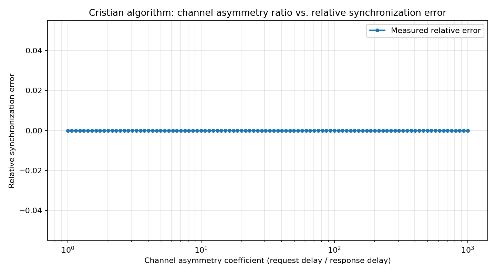

# Домашнее задание 1. Часы и время

## Обязательно подпишите свой Pull Request своим ФИО!

## 1. Алгоритм Кристиана

### 1.1 Имплементация алгоритма

Реализуйте [алгоритм Кристиана](https://en.wikipedia.org/wiki/Cristian%27s_algorithm) для синхронизации локальных часов реального времени с удаленными часами в файле `tasks/time_synchronization/cristian.py`.

Запустите тесты и проверьте свое решение:

```bash
pytest tests/time_synchronization/test_time_synchronization.py
```

### 1.2 Измерение

Реализуйте измерение относительной ошибки, получаемой при использовании алгоритма,
которая определяется как `|(local_time - remote_time) / remote_time|` после синхронизации часов.
Очевидно, мы принимаем `remote_time` как эталонное время.

Запустите тесты и проверьте свое решение:

```bash
pytest tests/time_synchronization/test_time_synchronization_experiment.py
```

Запустите скрипт с экспериментом и проанализируйте получившийся график, отражающий зависимость
относительной ошибки алгоритма от коэффициента асимметричности сетевого канала.

```bash
python tasks/time_synchronization/experiment.py    
```

Получившийся график должен находиться в файле `experiment.png` (не забудьте закоммитить):



### 1.3 Исследование и ответы на вопросы

Ответьте на вопросы в `ANSWERS.MD`.

## 2. Векторные часы

### 2.1 Имплементация алгоритма

Реализуйте алгоритм сортировки временных меток, соответствующих векторным часам, в файле `tasks/partial_sort/vector_clock.py`. На вход в метод попадает последовательность векторных часов, на выходе
должна оказаться та же самая последовательность в таком порядке, что соответствующие отсортированным
временным меткам события могут быть исполнены последовательно без нарушения свойства happens-before.

```python
VectorClock = Dict[str, int]

def partial_sort(timestamps: list[VectorClock]) -> list[VectorClock]:
    # TODO: implement me (task 2)
    return timestamps
```

Проверьте свое решение с помощью тестов:

```bash
pytest tests/partial_sort
```

### 2.2 Ответы на вопросы

Ответьте на вопросы в `ANSWERS.MD`.